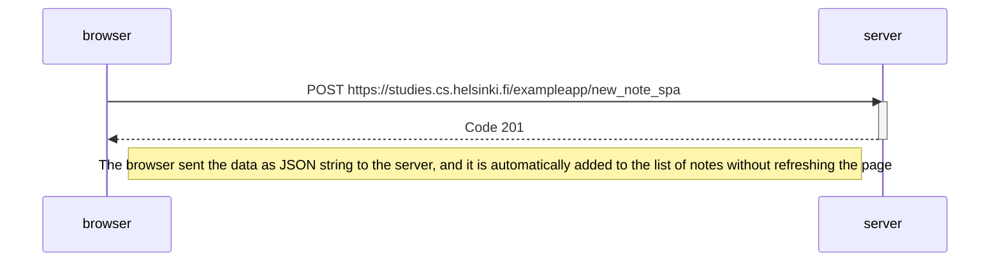

```mermaid
    sequenceDiagram
        participant browser
        participant server

        browser->>server: POST https://studies.cs.helsinki.fi/exampleapp/new_note_spa
        activate server
        server-->>browser: Code 201
        deactivate server

        Note left of server: The browser sent the data as JSON string to the server, and it is automatically added to the list of notes without refreshing the page
```